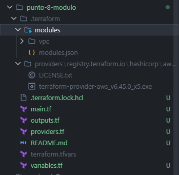
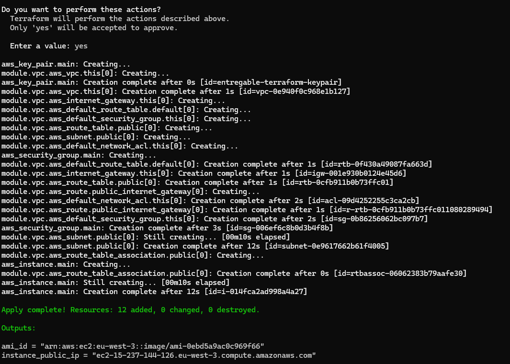
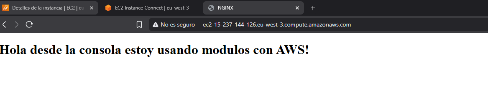

# Punto 8 – Refactorización con el VPC Module

Este directorio es una refactorización de los puntos 1–7. El objetivo es reemplazar todos los recursos manuales de red (VPC, Internet Gateway, Route Table, asociaciones…) por el módulo oficial **[terraform-aws-modules/vpc/aws](https://registry.terraform.io/modules/terraform-aws-modules/vpc/aws/latest)**, reduciendo así el código a mantener y aprovechando las buenas prácticas ya incorporadas en el módulo.

---

## Configuración de variables

Antes de desplegar, necesitas un fichero `terraform.tfvars` con tus valores reales. En la raíz del proyecto encontrarás el fichero **[`terraform.tfvars.template`](../terraform.tfvars.template)** con todas las variables documentadas y listas para rellenar.

```bash
# Copia la plantilla dentro de esta carpeta
cp ../terraform.tfvars.template terraform.tfvars

# Edita terraform.tfvars y rellena los valores
```

| Variable | Descripción |
|---|---|---|
| `aws_access_key` | AWS Access Key ID |
| `aws_secret_key` | AWS Secret Access Key |
| `my_ip` | Tu IP pública en CIDR `/32` |

> **Importante:** Añade `terraform.tfvars` a tu `.gitignore`. Nunca subas credenciales a un repositorio.

---

## Estructura de archivos

| Archivo | Descripción |
|---|---|
| `providers.tf` | Configuración del provider de AWS |
| `variables.tf` | Variables del proyecto (mismas que puntos 1–7) |
| `terraform.tfvars` | Valores concretos de las variables |
| `main.tf` | Infraestructura usando el módulo VPC + recursos propios |
| `outputs.tf` | Output con el DNS público de la instancia |

---

## ¿Qué cambia respecto a los puntos 1–7?

| Recurso | Puntos 1–7 (manual) | Punto 8 (módulo) |
|---|---|---|
| VPC | `aws_vpc` | Gestionado por el módulo |
| Internet Gateway | `aws_internet_gateway` | Gestionado por el módulo |
| Subnet pública | `aws_subnet` | Gestionado por el módulo |
| Route Table | `aws_route_table` | Gestionado por el módulo |
| Route Table Association | `aws_route_table_association` | Gestionado por el módulo |
| Security Group | `aws_security_group` | Sin cambios, recurso propio |
| Key Pair | `aws_key_pair` | Sin cambios, recurso propio |
| Instancia EC2 | `aws_instance` | Sin cambios (referencia via `module.vpc`) |

El módulo crea internamente todos los recursos de red con una sola declaración, lo que elimina ~50 líneas de configuración repetitiva.

---

## Uso del módulo VPC

```hcl
module "vpc" {
  source  = "terraform-aws-modules/vpc/aws"
  version = "6.6.1"

  name = "${var.project_name}-vpc"
  cidr = var.vpc_cidr

  azs            = ["${var.region}a"]
  public_subnets = [var.subnet_cidr]

  enable_nat_gateway      = false
  map_public_ip_on_launch = true

  enable_dns_support   = true
  enable_dns_hostnames = true
}
```

- **`azs`**: lista de zonas de disponibilidad donde crear las subnets.
- **`public_subnets`**: el módulo crea una subnet pública por cada CIDR de esta lista, junto con su Route Table y la asociación al Internet Gateway automáticamente.
- **`enable_nat_gateway = false`**: no necesitamos NAT Gateway porque solo hay subnets públicas.
- **`map_public_ip_on_launch = true`**: las instancias en las subnets públicas reciben IP pública al arrancar.

---

## Cómo el resto de recursos referencia al módulo

Después de reemplazar los recursos de red, el Security Group y la instancia EC2 acceden a los valores del módulo mediante sus **outputs**:

```hcl
# Security Group: usa el ID de la VPC creada por el módulo
resource "aws_security_group" "main" {
  vpc_id = module.vpc.vpc_id
  ...
}

# Instancia EC2: usa el ID de la primera subnet pública del módulo
resource "aws_instance" "main" {
  subnet_id = module.vpc.public_subnets[0]
  ...
}
```

---

## Terraform init con el módulo

Cuando se usa un módulo externo hay que ejecutar `terraform init` para que Terraform lo descargue del registro:

```bash
terraform init
```

Esto crea una carpeta `.terraform/modules/vpc/` con el código del módulo descargado.

> **Imagen sugerida:** Captura del terminal tras `terraform init` mostrando `Downloading terraform-aws-modules/vpc/aws 6.6.1`.



---

## Levantando la infraestructura utilizando el módulo

Aplicamos un `terraform apply` y comprobamos que se ha creado todo correcto y obtenemos los outputs:



Y accedemos al recurso desplegado:



---

## Ventajas del módulo

- **Menos código**: el módulo gestiona internamente ~10 recursos con una sola declaración.
- **Mantenimiento**: las actualizaciones de buenas prácticas de red se recogen actualizando la versión del módulo.
- **Reutilización**: el mismo módulo se puede usar en distintos entornos cambiando solo las variables.
- **Comunidad**: el módulo `terraform-aws-modules/vpc` es el más usado de la comunidad AWS+Terraform, con miles de contribuidores.
