# Puntos 1 – 7: Infraestructura AWS con Terraform (desde cero)

Este directorio contiene la solución a los puntos 1–7 del entregable. Se despliega una infraestructura completa en AWS que incluye red, seguridad, cómputo y automatización, todo con recursos Terraform nativos (sin módulos externos).

---

## Prerrequisito: permisos IAM en AWS

Antes de lanzar cualquier `terraform apply`, el usuario IAM cuyas credenciales uses debe tener permisos para crear recursos en AWS. Si no los tiene, Terraform fallará con un error como este:

1. Entra en **AWS Console → IAM → Users → `<tu usuario>` → Permissions**.
2. Pulsa **Add permissions → Attach policies directly**.
3. Adjunta la política **`AmazonEC2FullAccess`** y **`AdministratorAccess`**.
4. Guarda y vuelve a ejecutar `terraform apply`.

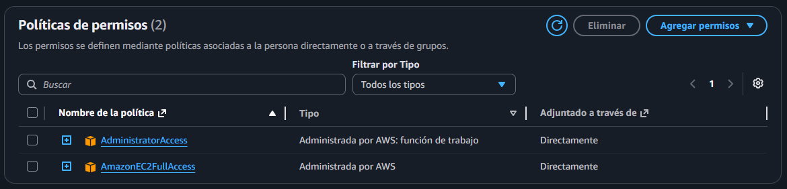

---

## Configuración de variables

Antes de desplegar, necesitas un fichero `terraform.tfvars` con tus valores reales. En la raíz del proyecto encontrarás el fichero **[`terraform.tfvars.template`](../terraform.tfvars.template)** con todas las variables documentadas y listas para rellenar.

```bash
# Copia la plantilla dentro de esta carpeta
cp ../terraform.tfvars.template terraform.tfvars

# Edita terraform.tfvars y rellena los valores
```

| Variable | Descripción |
|---|---|---|
| `aws_access_key` | AWS Access Key ID |
| `aws_secret_key` | AWS Secret Access Key |
| `my_ip` | Tu IP pública en CIDR `/32` |

> **Importante:** Añade `terraform.tfvars` a tu `.gitignore`. Nunca subas credenciales a un repositorio.

---

## Estructura de archivos

| Archivo | Descripción |
|---|---|
| `providers.tf` | Configuración del provider de AWS y versión de Terraform |
| `variables.tf` | Declaración de todas las variables del proyecto |
| `terraform.tfvars` | Valores concretos de las variables |
| `main.tf` | Todos los recursos de infraestructura |
| `outputs.tf` | Output con la IP pública de la instancia |

---

## Punto 1 – VPC con acceso a Internet

### Provider de AWS

Antes de poder crear cualquier recurso, Terraform necesita saber con qué nube va a hablar y cómo autenticarse. Eso se define en `providers.tf`.

```hcl
terraform {
  required_providers {
    aws = {
      source  = "hashicorp/aws"
      version = "~> 6.0"
    }
  }
}

provider "aws" {
  region     = var.region
  access_key = var.aws_access_key
  secret_key = var.aws_secret_key
}
```

- **`required_providers`**: declara que este proyecto necesita el provider oficial de AWS (`hashicorp/aws`) en cualquier versión `6.x`. Terraform lo descarga automáticamente al ejecutar `terraform init`.
- **`version = "~> 6.0"`**: el operador `~>` permite actualizaciones de parche (`6.0.1`, `6.1.0`…) pero no saltos de versión mayor, evitando cambios inesperados.
- **`provider "aws"`**: configura la región y las credenciales. Los valores se leen de variables para no hardcodear secretos en el código.

---

### VPC e Internet Gateway

Se crea una **VPC** con el bloque CIDR definido por variable (`10.0.0.0/16` por defecto), con soporte DNS activado para que las instancias puedan resolver nombres.

Para dar salida a Internet se asocia un **Internet Gateway** a la VPC.

```hcl
resource "aws_vpc" "main" { ... }
resource "aws_internet_gateway" "main" { ... }
```

VPC e Internet Gateway:

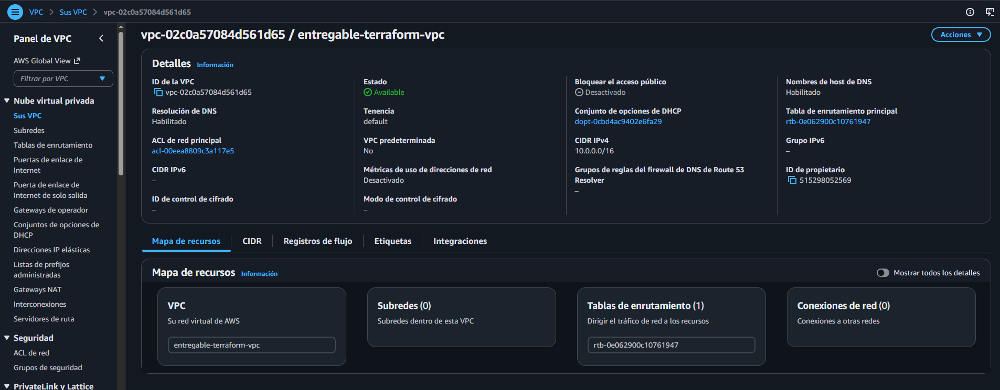
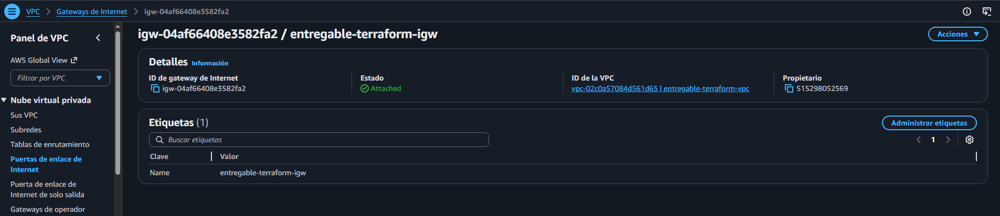

---

## Punto 2 – Subnet pública con acceso a Internet

Dentro de la VPC se crea una **subnet pública** (`10.0.1.0/24`) en la zona de disponibilidad `a` de la región elegida. Se activa `map_public_ip_on_launch` para que las instancias reciban automáticamente una IP pública al arrancar.

Para enrutar el tráfico hacia Internet se crea una **Route Table** con una ruta `0.0.0.0/0 → Internet Gateway`, que se asocia a la subnet mediante un `aws_route_table_association`.

```hcl
resource "aws_subnet" "public" { ... }
resource "aws_route_table" "public" { ... }
resource "aws_route_table_association" "public" { ... }
```

Captura de la sección "Route Tables" en la consola de AWS mostrando la ruta `0.0.0.0/0` apuntando al IGW:

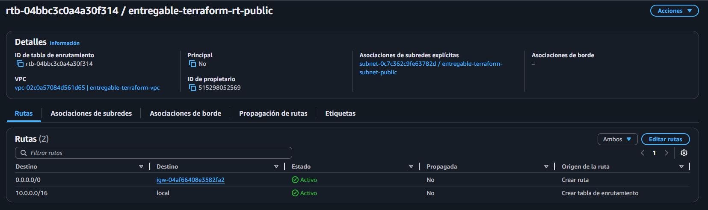

---

## Punto 3 – Security Group

Se crea un **Security Group** con las siguientes reglas:

| Dirección | Puerto | Protocolo | Origen |
|---|---|---|---|
| Entrada | 80 | TCP | `0.0.0.0/0` (cualquier IP) |
| Entrada | 22 | TCP | Tu IP personal en CIDR `/32` |
| Salida | Todos | Todos | `0.0.0.0/0` |

La IP personal se pasa como variable (`my_ip`) para no exponer la dirección en el código.

Rules del Security Group:

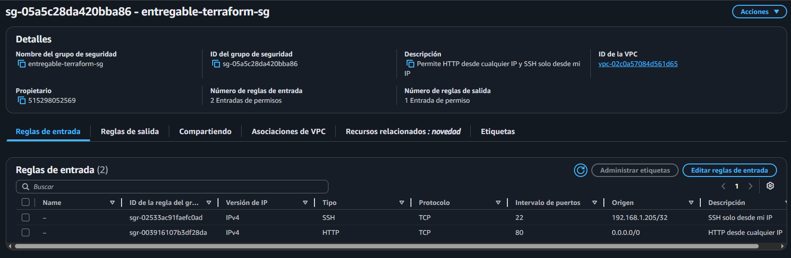
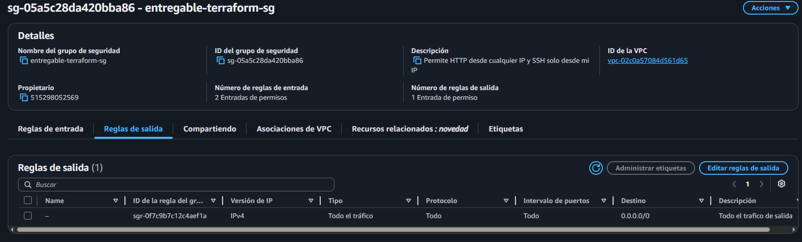

---

## Punto 4 – Key Pair para SSH

Se registra en AWS un **Key Pair** a partir de tu clave pública local (por defecto `~/.ssh/id_rsa.pub`). Terraform lee el fichero con la función `file()` y crea el recurso `aws_key_pair`.

```bash
# Si no tienes una clave SSH create una:
ssh-keygen -t rsa -b 4096 -f ~/.ssh/id_rsa
```

```hcl
resource "aws_key_pair" "main" {
  key_name   = "${var.project_name}-keypair"
  public_key = file(var.public_key_path)
}
```

Sección "Key Pairs" en EC2:

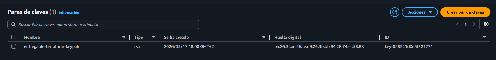

---

## Punto 5 – Instancia EC2 en la subnet pública

Se utiliza un **data source** para buscar automáticamente la AMI más reciente de Amazon Linux 2023 (`al2023-ami-*-x86_64`), por lo que no hay que hardcodear un ID de AMI. La instancia se despliega con tipo `t2.micro` (free tier) en la subnet pública creada anteriormente, asociándole el Security Group y el Key Pair.

Una vez desplegado, puedes conectarte por SSH, se muestra la conexión SSH exitosa a la instancia EC2 desde nuestra máquina:

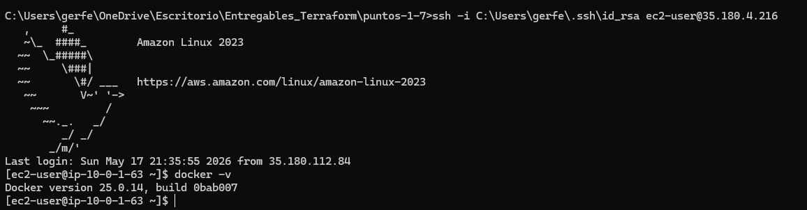

Hemos añadido una regla más para además de conectarnos desde nuestra máquina poderlo hacerlo también desde la interfaz de AWS:

```hcl
  ingress {
    description = "SSH desde EC2 Instance Connect"
    from_port   = 22
    to_port     = 22
    protocol    = "tcp"
    cidr_blocks = ["35.180.112.80/29"]
  }
```

**Nota**: Hemos tenido que hacer una pequeñita trampa ya que no conseguiamos conectarnos, y utilizando la conexión SSH desde nuestra máquina hemos instalado en la instancia el paquete de `ec2-instance-connect`

Conexión exitosa desde la interfaz:

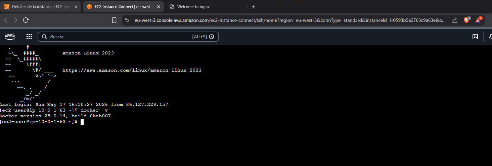

---

## Punto 6 – Instalación de Docker vía user_data

El bloque `user_data` de la instancia ejecuta un script Bash en el primer arranque que:

1. Actualiza los paquetes del sistema (`dnf update`)
2. Instala Docker (`dnf install docker`)
3. Habilita e inicia el servicio Docker
4. Añade `ec2-user` al grupo `docker` para no necesitar `sudo`

```bash
#!/bin/bash
dnf update -y
dnf install -y docker
systemctl enable docker
systemctl start docker
usermod -aG docker ec2-user
```

Una vez conectado por SSH, verificamos que Docker está funcionando y lanzar un contenedor NGINX para servir tráfico en el puerto 80:

```bash
# Verificar Docker
docker ps

# Lanzar NGINX
docker run -d -p 80:80 nginx
```

Mostramos una imagen donde se puede ver que esta corriendo el Nginx en nuestra máquina:

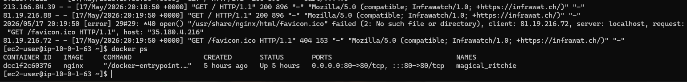

Navegador accediendo a `http://35.180.4.216/` y mostrando la página de bienvenida de NGINX.

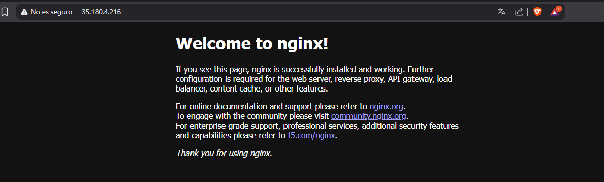

Navegador accediendo a la instancia pero está vez resolviendo por DNS (en el siguiente apartado la podemos ver en el output) y mostrando la página de bienvenida de NGINX.

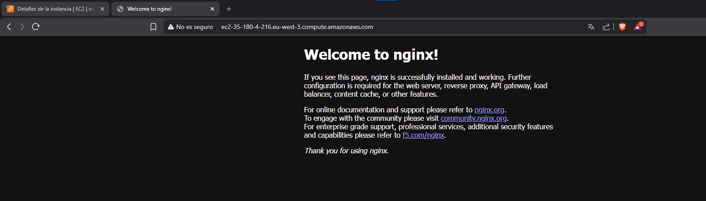

---

## Punto 7 – Output con la IP pública

Se declara un output que muestra el DNS público de la instancia EC2 una vez que `terraform apply` termina. Esto evita tener que buscarla manualmente en la consola.

```hcl
output "instance_public_ip" {
  description = "IP pública de la instancia EC2"
  value       = aws_instance.main.public_dns
}
```

Resultado al ejecutar `terraform apply`:

```
Outputs:

instance_public_ip = "ec2-35-180-4-216.eu-west-3.compute.amazonaws.com"
```

Captura del terminal mostrando el output de Terraform con el DNS/IP de la instancia, además he añadido información de la AMI utilizada porque tenia curiosidad sobre el free tier y quería ver cual era la seleccionada:

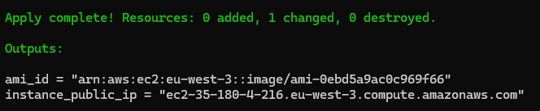

---